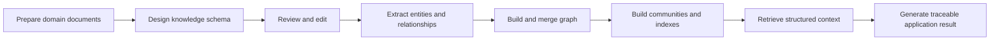
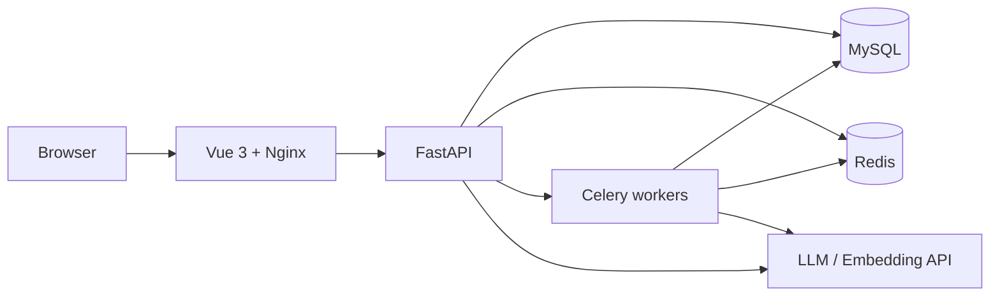

<div align="center">

# UniGraph

<a href="README.md">中文</a> · English

### An end-to-end knowledge graph workbench for traceable knowledge applications

**Model the domain first, build the graph next, and connect every result back to entities, relationships, and source documents.**

[](https://vuejs.org/)
[](https://fastapi.tiangolo.com/)
[](https://www.python.org/)
[](https://docs.docker.com/compose/)
[](LICENSE)

[🚀 Live demo](https://unigraph.jxselab.com/login) · [⚡ Quick start](#-quick-start) · [🏗️ Architecture](docs/TECHNICAL_ARCHITECTURE.en.md) · [📦 Deployment](docs/DEPLOYMENT.md) · [🎬 Tutorials](#-tutorials) · [🤝 Contributing](CONTRIBUTING.md)

<a href="docs/assets/screenshots/graph-design.png">
  
</a>

<sub>Design the domain, build the graph, and apply knowledge from one unified workbench.</sub>

</div>

---

## 💡 Why UniGraph

Traditional knowledge bases often stop at document chunking and vector search. They are much less effective at expressing entities, relationships, domain rules, and explainable reasoning.

UniGraph provides three connected capabilities:

- **Structured modeling** — define entities, relationships, attributes, and domain constraints;
- **Automated construction** — extract entities and relationships from documents and build an editable graph;
- **Traceable applications** — connect each result to graph paths and original information sources.

## 🧭 From documents to knowledge applications



| Stage | What you do | What you get |
| --- | --- | --- |
| **Define** | Design entity types, relationship types, and attributes | A reusable and explainable domain schema |
| **Build** | Extract, review, merge, and migrate graph knowledge | An editable instance graph |
| **Apply** | Combine entities, relationships, sources, and community summaries | A traceable result that can be explored further |

## 🔍 More than ordinary document RAG

Here, “ordinary document RAG” means a solution primarily based on text chunks, vector retrieval, and LLM generation without an additional structured knowledge layer.

| Capability | Ordinary document RAG | UniGraph |
| --- | :---: | :---: |
| Semantic document retrieval | ✓ Native | ✓ Native |
| Knowledge schema before extraction | — Not provided | ✓ Native |
| Human review of entity and relationship types | — Not provided | ✓ Native |
| Graph visualization and editing | — Not provided | ✓ Native |
| Local relationships combined with global communities | △ Extensible | ✓ Native |
| Entity, relationship, source, and community citations | — Not provided | ✓ Native |
| Continuous knowledge updates and merging | △ Extensible | ✓ Native |
| Multi-turn applications and background tasks | △ Extensible | ✓ Native |

## 🧩 Three workspaces, one knowledge loop

<table>
<tr>
<td width="33%" valign="top">

### 01 · Design

- Generate an initial schema from domain material
- Review entity types, relationship types, and attributes
- Iterate on the schema and reuse it across projects

</td>
<td width="33%" valign="top">

### 02 · Build

- Process PDF, DOCX, TXT, JSON, and other supported files
- Inspect and edit entities, relationships, and sources
- Track long-running extraction and migration tasks

</td>
<td width="33%" valign="top">

### 03 · Apply

- Combine entities, relationships, sources, and community reports
- Follow the retrieval process and structured citations
- Continue from history, shared conversations, or refreshed pages

</td>
</tr>
</table>

## 👀 See the knowledge workflow

The key idea is to make every important step visible, reviewable, and editable instead of hiding the entire workflow behind a single prompt box.

### ① Design a domain model

Define entity types, relationships, and attribute constraints before building the graph.

<a href="docs/assets/screenshots/graph-design.png">
  
</a>

### ② Build an editable knowledge graph

Import documents, extract entities and relationships, and inspect the result through a visual graph.

<a href="docs/assets/screenshots/graph-build.png">
  
</a>

### ③ Apply knowledge with evidence

Explore results that can be traced back to graph paths and original information sources.

<a href="docs/assets/screenshots/knowledge-application.png">
  
</a>

> UniGraph connects **documents → knowledge → graph → application** into one traceable production line.

Detailed design, construction, indexing, and retrieval behavior is documented in the [technical architecture guide](docs/TECHNICAL_ARCHITECTURE.en.md).

## 🏗️ System architecture



| Layer | Technology |
| --- | --- |
| Workbench | Vue 3, Vite, TypeScript, Cytoscape, vis-network |
| API and business logic | FastAPI, Pydantic, SQLAlchemy |
| Data and tasks | MySQL, Redis, Celery |
| Graph retrieval | Leiden communities, entity vectors, local and global context |
| AI integration | OpenAI-compatible LLM and embedding APIs |
| Deployment | Docker Compose, Nginx, or traditional processes |

## ⚡ Quick start

Under normal network conditions, UniGraph can be started in about five minutes after configuration.

Requirements:

- Docker 24+
- Docker Compose v2
- At least 4 GB of available memory
- An LLM API key and an embedding API key

```bash
git clone https://github.com/CodingFeng101/UniGraph.git
cd UniGraph
cp .env.docker.example .env.docker
docker compose --env-file .env.docker up -d --build
```

Edit `.env.docker` before startup and replace the database password, all `replace-with-...` secrets, and the development-only Base64 key containing `changeme`.

| Service | Address |
| --- | --- |
| Web workbench | http://localhost:8080 |
| Health check | http://localhost:8000/knowg/v1/health |
| OpenAPI | http://localhost:8000/knowg/v1/docs |

See the [deployment guide](docs/DEPLOYMENT.md) for traditional startup, production deployment, migrations, and troubleshooting.

## 📚 Documentation

- [Technical architecture](docs/TECHNICAL_ARCHITECTURE.en.md)
- [Deployment guide](docs/DEPLOYMENT.md)
- [Chinese README](README.md)
- [Contributing guide](CONTRIBUTING.md)
- [Security policy](SECURITY.md)
- [Third-party notices](THIRD_PARTY_NOTICES.md)

## 🎬 Tutorials

- [UniGraph: an end-to-end knowledge graph platform](https://www.bilibili.com/video/BV1jkivYZEyB)
- [Knowledge schema design](https://www.bilibili.com/video/BV1weR8YeEPh)
- [Knowledge graph construction](https://www.bilibili.com/video/BV1ceR8YeEhD)
- [Knowledge graph retrieval](https://www.bilibili.com/video/BV1weR8YeEjv)

## 📌 Project status

UniGraph is currently in Beta. The complete flow from domain design and knowledge construction to graph exploration and traceable knowledge applications is available. Some advanced capabilities are still being improved, so production-critical use is not recommended yet.

## 🔒 Security and license

Do not commit `.env` files, logs, uploaded files, databases, private keys, or real business data. Please report security issues privately according to [SECURITY.md](SECURITY.md).

UniGraph is released under the [GNU Affero General Public License v3.0](LICENSE).

<div align="center">

If UniGraph is useful for your knowledge engineering work, consider trying it, starring the repository, and sharing feedback.

</div>

## 🙏 Acknowledgements

- **Project contributors:**

<p>
  <a href="https://github.com/SE-qinghuang"></a>
  <a href="https://github.com/YuCheng1106"></a>
  <a href="https://github.com/lixian292"></a>
  <a href="https://github.com/LiKunKun64867"></a>
</p>
