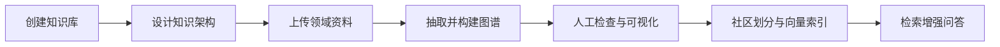
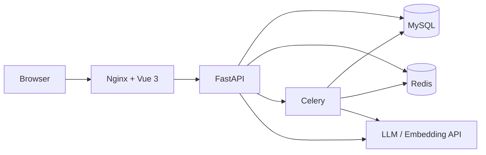

<div align="center">

# 🕸️ UniGraph

**一站式知识图谱设计、构建、检索与问答平台**

[](https://vuejs.org/)
[](https://fastapi.tiangolo.com/)
[](https://www.python.org/)
[](https://docs.docker.com/compose/)
[](LICENSE)

[快速开始](#-快速开始) · [技术文档](docs/TECHNICAL_ARCHITECTURE.md) · [部署文档](docs/DEPLOYMENT.md) · [视频教程](#-视频教程) · [安全政策](SECURITY.md)

</div>

UniGraph 把知识架构设计、文档抽取、图谱构建、社区索引、可视化探索和知识问答放进同一个 Web 工作台。它适合知识工程实验、领域知识库建设、课程与科研项目，也可以作为二次开发的完整基础工程。

> 当前版本面向自行部署。正式对公网开放前，请配置 HTTPS、独立随机密钥、备份、资源限额和监控，并完成 [发布前清单](docs/OPEN_SOURCE_CHECKLIST.md)。

## ✨ 核心能力

- **知识库管理**：资料、知识架构、知识图谱和历史对话统一归档。
- **知识架构设计**：维护实体类型、关系类型和属性，也支持基于文档生成初始 Schema。
- **图谱构建**：从 PDF、DOCX、TXT、JSON 等资料抽取实体与关系，支持推理、融合和任务进度追踪。
- **图谱可视化**：支持自由布局、层次布局、环形布局等展示方式，以及实体和关系的查看与编辑。
- **图谱索引**：使用 Leiden 社区划分、社区报告和实体属性向量构建局部与全局上下文。
- **流式问答**：NDJSON 流式答案、处理阶段时间线、历史上下文压缩和来源上下文。
- **模型管理**：多个语言模型、单一嵌入模型、连接测试、加密保存 API Key；问答可选择语言模型。
- **多人使用**：业务资源、模型配置和后台任务按用户隔离，名称约束采用用户内唯一。
- **后台任务中心**：显示开始时间、稳定的当前步骤动效、错误详情与原任务重试。

## 🧭 工作流



技术路线、12 张设计/构建/检索流程图及实现边界见 [技术架构文档](docs/TECHNICAL_ARCHITECTURE.md)。

## 🏗️ 系统架构



| 模块 | 技术 |
| --- | --- |
| 前端 | Vue 3、Vite、TypeScript、Cytoscape、vis-network |
| 后端 | FastAPI、Pydantic、SQLAlchemy、MySQL |
| 异步任务 | Celery、Redis |
| 检索 | Leiden 社区、实体向量、图谱局部/社区上下文 |
| 部署 | Docker Compose、Nginx，或传统进程部署 |

## 🚀 快速开始

### 方式一：Docker Compose

要求 Docker 24+ 和 Docker Compose v2。

```bash
git clone https://github.com/CodingFeng101/UniGraph.git
cd UniGraph
cp .env.docker.example .env.docker
```

Windows PowerShell：

```powershell
git clone https://github.com/CodingFeng101/UniGraph.git
Set-Location UniGraph
Copy-Item .env.docker.example .env.docker
```

编辑 `.env.docker`，至少替换数据库密码以及所有 `replace-with-...` 密钥。可用 Python 生成随机值：

```bash
python -c "import secrets; print(secrets.token_urlsafe(48))"
python -c "import base64,secrets; print(base64.b64encode(secrets.token_bytes(32)).decode())"
```

启动：

```bash
docker compose --env-file .env.docker up -d --build
docker compose --env-file .env.docker ps
```

访问：

- Web：`http://localhost:8080`
- 后端健康检查：`http://localhost:8000/knowg/v1/health`
- OpenAPI（开发环境）：`http://localhost:8000/knowg/v1/docs`

生产单机部署使用叠加配置：

```bash
docker compose --env-file .env.docker -f compose.yaml -f deploy/compose.prod.yaml up -d --build
```

### 方式二：传统部署

要求 Python 3.11、Node.js 20+、MySQL 8.x 和 Redis 7.x。

```bash
cp backend/.env.template backend/.env
python -m venv .venv
python -m pip install -r backend/requirements.txt
python -m uvicorn backend.main:app --host 0.0.0.0 --port 8000
```

另开终端启动 Worker：

```bash
celery -A backend.app.task.celery:celery_app worker --loglevel=info
```

Windows 使用：

```powershell
celery -A backend.app.task.celery:celery_app worker --pool=solo --loglevel=info
```

前端：

```bash
cd frontend
npm ci
npm run dev
```

数据库初始化、生产 Nginx、迁移、持久化和排障步骤见 [部署文档](docs/DEPLOYMENT.md)。

## 🤖 配置模型

登录后进入“个人中心 → 模型配置”：

1. 添加至少一个 OpenAI 兼容的语言模型；
2. 添加一个嵌入模型；每个用户只能保留一个嵌入模型；
3. 使用“测试”按钮确认模型、Base URL 和 API Key 可用；
4. 构建索引后，在历史对话中选择知识图谱开始问答。

API Key 会在后端加密保存，页面只显示“已保存”状态而不会回显明文。编辑已有配置时留空表示保留原密钥。

## 📚 文档

| 文档 | 内容 |
| --- | --- |
| [技术架构](docs/TECHNICAL_ARCHITECTURE.md) | 系统架构、知识设计、构建、索引、检索、流式问答和安全边界 |
| [部署指南](docs/DEPLOYMENT.md) | Docker 与传统部署、迁移、健康检查、升级和排障 |
| [发布前清单](docs/OPEN_SOURCE_CHECKLIST.md) | 代码、依赖、安全、数据迁移与运行态验收 |
| [安全政策](SECURITY.md) | 漏洞私密报告方式和生产安全要求 |
| [贡献指南](CONTRIBUTING.md) | 开发、测试和 Pull Request 约定 |
| [第三方声明](THIRD_PARTY_NOTICES.md) | 第三方项目与许可证说明 |

## 🎬 视频教程

- [一站式知识图谱智造平台](https://www.bilibili.com/video/BV1jkivYZEyB)
- [知识架构设计解说](https://www.bilibili.com/video/BV1weR8YeEPh)
- [知识图谱构建解说](https://www.bilibili.com/video/BV1ceR8YeEhD)
- [知识图谱检索解说](https://www.bilibili.com/video/BV1weR8YeEjv)
- [UniGraph & Sapper：导入智能体平台](https://www.bilibili.com/video/BV1kcZuYjEuM)

## 🗂️ 项目结构

```text
.
├── backend/                 # FastAPI、业务模块、核心算法和测试
│   ├── app/                 # admin / kgbase / task / file 等业务模块
│   ├── common/core_layer/   # Schema、图谱构建、索引与检索核心层
│   ├── migrations/          # 已有数据库的增量迁移
│   └── tests/               # 回归、安全和运行时测试
├── frontend/                # Vue 3 工作台
│   └── src/                 # 页面、控制器、组件、API 与图渲染
├── deploy/                  # Dockerfile、Nginx、MySQL 初始化与生产配置
├── docs/                    # 技术、部署和发布文档
├── var/                     # 本地运行数据，仅保留 .gitkeep
└── compose.yaml             # 单机 Compose 编排
```

## ✅ 开发检查

```bash
python -m ruff format --check backend
python -m ruff check backend
python -m pytest backend/tests -q
python backend/tests/smoke_import.py

cd frontend
npm run lint
npm run typecheck
npm run build
npm audit --audit-level=high
```

CI 会执行后端格式/测试/依赖审计、前端类型/构建/依赖审计和 Compose 配置校验。

## 🔐 安全提示

- 不要提交 `.env`、日志、上传文件、数据库、私钥或真实业务数据。
- 如果密钥曾进入 Git 历史，仅删除文件不够；必须轮换密钥并清理历史。
- 生产环境必须启用 HTTPS、`ENVIRONMENT=pro`、`COOKIE_SECURE=true` 和明确的 `CORS_ALLOWED_ORIGINS`。
- 请妥善备份 `LLM_API_KEY_ENCRYPTION_KEY`；丢失后无法解密已保存的模型密钥。
- 默认禁止访问私有网段模型地址。只有在可信隔离网络中才应开启 `ALLOW_PRIVATE_LLM_ENDPOINTS`。

发现安全问题请按 [SECURITY.md](SECURITY.md) 私密报告，不要提交公开 Issue。

## 🤝 贡献与许可

欢迎提交 Issue 和 Pull Request。开始前请阅读 [CONTRIBUTING.md](CONTRIBUTING.md)，保持改动聚焦并附带可复现的测试。

UniGraph 以 [MIT License](LICENSE) 开源。第三方归属信息见 [THIRD_PARTY_NOTICES.md](THIRD_PARTY_NOTICES.md)。
