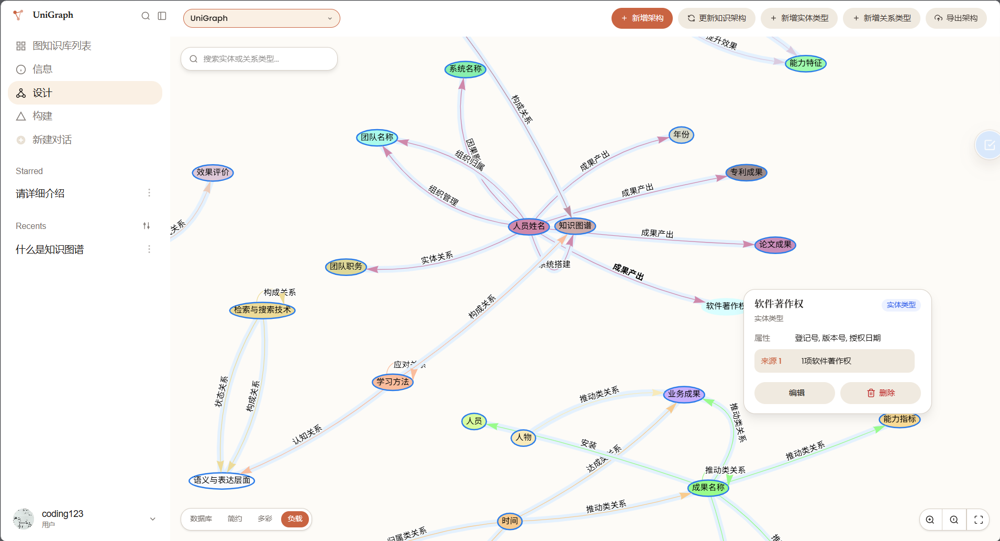
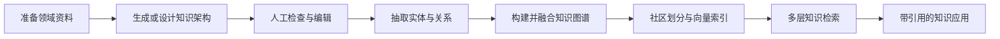
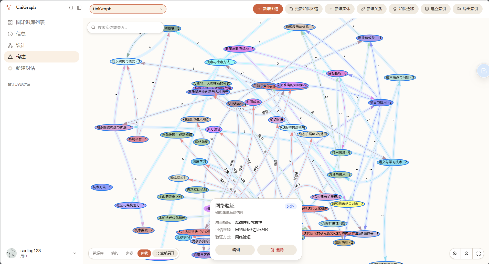
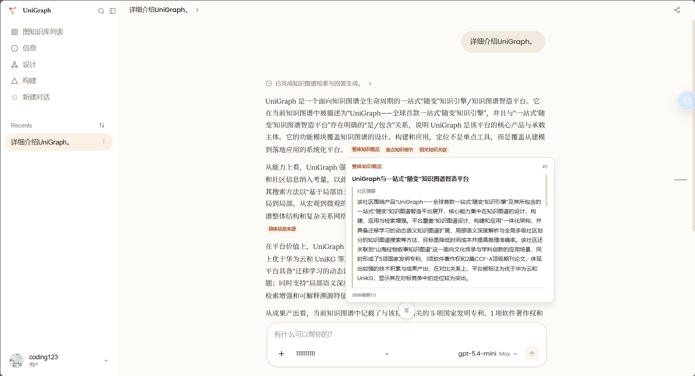
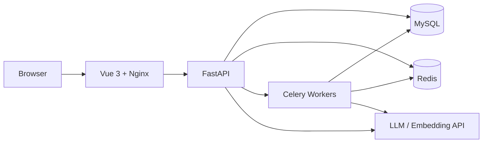

<div align="center">

# UniGraph

<a href="README.en.md">English</a> · 中文

### 从领域资料到可追溯知识应用的一站式知识图谱工作台

**先定义知识，再构建图谱，最后让每个应用结果都能回到实体、关系与原始信息。**

[](https://vuejs.org/)
[](https://fastapi.tiangolo.com/)
[](https://www.python.org/)
[](https://docs.docker.com/compose/)
[](LICENSE)

[🚀 在线体验](https://unigraph.jxselab.com/login) · [⚡ 快速开始](#-五分钟启动) · [🏗️ 技术架构](docs/TECHNICAL_ARCHITECTURE.md) · [📦 部署指南](docs/DEPLOYMENT.md) · [🎬 视频教程](#-视频教程) · [🤝 参与贡献](CONTRIBUTING.md)

<a href="docs/assets/screenshots/graph-design.png">
  
</a>

<sub>从领域建模、图谱构建到知识应用，所有关键步骤都在同一个工作台中完成。</sub>

</div>

---

## 💡 为什么是 UniGraph

传统知识库通常只完成文档切片和向量检索，但难以表达实体关系、领域规则和可解释的推理过程。

UniGraph 提供三个核心能力：

- **结构化建模**：定义实体、关系和领域属性；
- **自动化构建**：从文档中抽取实体与关系，形成知识图谱；
- **可追溯应用**：应用结果同时关联图谱路径与原始信息源。

## 🧭 一条完整的知识故事线



| 阶段 | 你在做什么 | 最终得到什么 |
| --- | --- | --- |
| **定义知识** | 从资料生成初始架构，人工调整实体类型、关系类型和属性 | 可复用、可解释的领域 Schema |
| **构建知识** | 按确认后的架构抽取实体与关系，完成图谱融合与知识迁移 | 可以查看和编辑的实例图谱 |
| **使用知识** | 构建社区报告与向量索引，组合实体、关系、来源和全局概览 | 可追溯、可继续追问的应用结果 |

## 🔍 不只是普通文档 RAG

这里的“普通文档 RAG”，指以文本切片、向量检索和大模型生成为主，未额外构建结构化知识层的方案。

| 能力 | 普通文档 RAG | UniGraph |
| --- | :---: | :---: |
| 文档语义检索 | ✓ 原生支持 | ✓ 原生支持 |
| 先定义知识架构 | — 不提供 | ✓ 原生支持 |
| 人工确认实体与关系类型 | — 不提供 | ✓ 原生支持 |
| 图谱可视化与编辑 | — 不提供 | ✓ 原生支持 |
| 局部关系与全局社区结合 | △ 可扩展实现 | ✓ 原生支持 |
| 实体、关系、原文和社区四类引用 | — 不提供 | ✓ 原生支持 |
| 知识持续更新与融合 | △ 可扩展实现 | ✓ 原生支持 |
| 多轮对话与后台应用 | △ 可扩展实现 | ✓ 原生支持 |

## 🧩 从领域设计到知识应用，只需三个工作区

<table>
<tr>
<td width="33%" valign="top">

### 01 · 设计

- 从领域资料生成初始知识架构
- 人工审查实体类型、关系类型和属性
- 迭代修改并生成架构建议
- 导入、导出和复用知识架构

</td>
<td width="33%" valign="top">

### 02 · 构建

- 从 PDF、DOCX、TXT、JSON 等资料抽取知识
- 查看和编辑实体、关系及其来源
- 执行知识迁移与图谱融合
- 使用后台任务追踪长时间操作

</td>
<td width="33%" valign="top">

### 03 · 应用

- 组合实体、关系、信息源和社区报告
- 展示逐步检索和应用过程
- 在应用正文中提供可交互引用
- 支持历史对话、分享和刷新后恢复

</td>
</tr>
</table>

## 👀 看得见的知识工程

UniGraph 的重点不是把复杂能力藏在一个“应用”按钮后面，而是让知识从设计、构建到应用的每一步都可见、可检查、可继续编辑。

### ① 设计领域模型

定义人物、机构、项目等实体类型，以及实体之间的关系和属性约束。

<a href="docs/assets/screenshots/graph-design.png">
  
</a>

### ② 自动构建知识图谱

导入文档后自动抽取实体与关系，并通过可视化图谱检查构建结果。

<a href="docs/assets/screenshots/graph-build.png">
  
</a>

### ③ 基于证据进行知识应用

应用结果可以回溯到知识图谱路径和原始文档信息源。

<a href="docs/assets/screenshots/knowledge-application.png">
  
</a>

> 一句话理解 UniGraph：把“资料 → 知识 → 图谱 → 应用”连成一条可追溯的生产线。

### ✅ 图谱不是终点，可验证的知识应用才是

UniGraph 会将局部实体与关系、原始信息源和全局社区概览组织成统一上下文。应用结果中的引用可以继续展开，帮助用户判断结论来自哪里，而不是只接受一个无法验证的模型答案。

详细的设计、构建、索引与检索流程见 [技术架构文档](docs/TECHNICAL_ARCHITECTURE.md)。

## 🏗️ 系统架构



| 层次 | 技术 |
| --- | --- |
| Web 工作台 | Vue 3、Vite、TypeScript、Cytoscape、vis-network |
| API 与业务 | FastAPI、Pydantic、SQLAlchemy |
| 数据与任务 | MySQL、Redis、Celery |
| 图谱检索 | Leiden 社区、实体向量、局部与全局上下文 |
| AI 接入 | OpenAI 兼容语言模型与嵌入模型 |
| 部署 | Docker Compose、Nginx，或传统进程部署 |

## ⚡ 五分钟启动

### Docker Compose（推荐）

正常网络环境下，完成配置后约五分钟可以启动。

环境要求：

- Docker 24+
- Docker Compose v2
- 至少 4 GB 可用内存
- 可用的大模型 API Key 和嵌入模型 API Key

```bash
git clone https://github.com/CodingFeng101/UniGraph.git
cd UniGraph
cp .env.docker.example .env.docker
```

Windows PowerShell：

```powershell
git clone https://github.com/CodingFeng101/UniGraph.git
Set-Location UniGraph
Copy-Item .env.docker.example .env.docker
```

编辑 `.env.docker`，替换数据库密码、所有 `replace-with-...` 密钥，以及包含 `changeme` 的开发用 Base64 密钥，然后启动：

```bash
docker compose --env-file .env.docker up -d --build
docker compose --env-file .env.docker ps
```

| 服务 | 地址 |
| --- | --- |
| Web 工作台 | http://localhost:8080 |
| 健康检查 | http://localhost:8000/knowg/v1/health |
| OpenAPI（开发环境） | http://localhost:8000/knowg/v1/docs |

生产单机部署与 HTTPS、持久化、迁移和升级步骤见 [部署指南](docs/DEPLOYMENT.md)。

<details>
<summary><strong>传统方式启动</strong></summary>

<br>

要求 Python 3.11–3.12、Node.js 22.22.2+、MySQL 8.x 和 Redis 7.x。

```bash
cp backend/.env.template backend/.env
python -m venv .venv
source .venv/bin/activate
python -m pip install -r backend/requirements.txt
python -m alembic -c backend/alembic.ini upgrade head
python -m uvicorn backend.main:app --host 0.0.0.0 --port 8000
```

另开四个终端启动隔离的 Celery 队列（并发数可通过环境变量调整）：

```bash
celery -A backend.app.task.celery:celery_app worker -Q default --concurrency=4 --loglevel=info
celery -A backend.app.task.celery:celery_app worker -Q qa --concurrency=8 --loglevel=info
celery -A backend.app.task.celery:celery_app worker -Q indexing --concurrency=2 --loglevel=info
celery -A backend.app.task.celery:celery_app worker -Q migration --concurrency=2 --loglevel=info
```

启动前端：

```bash
cd frontend
npm ci
npm run dev
```

Windows 多 worker 和完整排障命令见 [部署指南](docs/DEPLOYMENT.md)。

</details>

## 📚 文档导航

| 文档 | 适合谁 | 内容 |
| --- | --- | --- |
| [快速开始](#-五分钟启动) | 第一次使用者 | 安装、配置和首次启动 |
| [技术架构](docs/TECHNICAL_ARCHITECTURE.md) | 开发者、研究者 | 设计、构建、索引、检索、应用和安全边界 |
| [English Architecture](docs/TECHNICAL_ARCHITECTURE.en.md) | English readers | English technical architecture |
| [部署指南](docs/DEPLOYMENT.md) | 运维与部署人员 | Docker、传统部署、迁移、升级和排障 |
| [贡献指南](CONTRIBUTING.md) | 贡献者 | 开发、测试和 Pull Request 约定 |
| [安全政策](SECURITY.md) | 安全研究者 | 漏洞私密报告方式 |
| [第三方声明](THIRD_PARTY_NOTICES.md) | 使用者 | 第三方组件与许可证信息 |

## 🛠️ 第一次使用

1. 登录系统；
2. 创建知识库并导入领域文档；
3. 定义实体、关系和属性，生成知识架构；
4. **在抽取前人工检查并编辑实体类型、关系类型和属性；**
5. 启动知识抽取，检查可视化图谱结果；
6. 构建社区与向量索引；
7. 进入知识应用，基于证据开始探索和追问。

API Key 会在后端加密保存，编辑模型时留空表示保留已有密钥，页面不会回显明文。

## 🎬 视频教程

- [一站式知识图谱智造平台](https://www.bilibili.com/video/BV1jkivYZEyB)
- [知识架构设计解说](https://www.bilibili.com/video/BV1weR8YeEPh)
- [知识图谱构建解说](https://www.bilibili.com/video/BV1ceR8YeEhD)
- [知识图谱检索解说](https://www.bilibili.com/video/BV1weR8YeEjv)
- [UniGraph & Sapper：导入智能体平台](https://www.bilibili.com/video/BV1kcZuYjEuM)

## 📌 项目状态

UniGraph 当前处于 Beta 阶段，已经可以完成领域设计、知识构建、图谱查看和可追溯知识应用的完整流程。部分高级功能仍在持续完善，暂不建议直接用于关键生产环境。

## 🗂️ 项目结构

```text
.
├── backend/                 # FastAPI、业务模块、核心算法和测试
│   ├── app/                 # 用户、知识库、图谱与任务模块
│   ├── common/core_layer/   # Schema、构建、索引与检索核心层
│   ├── migrations/          # 数据库增量迁移
│   └── tests/               # 回归、安全和运行时测试
├── frontend/                # Vue 3 Web 工作台
├── deploy/                  # Dockerfile、Nginx 与生产配置
├── docs/                    # 技术、部署与发布文档
└── compose.yaml             # Docker Compose 编排
```

## 🧪 开发与验证

```bash
python -m ruff format --check backend
python -m ruff check backend
python -m pytest backend/tests -q

cd frontend
npm run lint
npm run typecheck
npm test
npm run build
```

CI 会执行后端格式、测试、迁移头检查和依赖审计，前端单元测试、类型、构建和依赖审计，以及完整 Docker 健康冒烟。

## 🔒 安全

- 不要提交 `.env`、日志、上传文件、数据库、私钥或真实业务数据；
- 生产环境应启用 HTTPS、随机密钥、备份、资源限额和监控；
- 请妥善保存 `LLM_API_KEY_ENCRYPTION_KEY`，丢失后无法解密已有模型凭据；
- 默认禁止访问私有网段模型地址，仅应在可信隔离网络中开启；
- 安全问题请按 [SECURITY.md](SECURITY.md) 私密报告，不要公开提交漏洞细节。

## 🤝 贡献与许可

欢迎提交 Issue 和 Pull Request。开始前请阅读 [贡献指南](CONTRIBUTING.md)，保持改动聚焦，并为行为变化附带可复现的测试。

UniGraph 使用 [GNU Affero General Public License v3.0](LICENSE) 开源。若修改后的版本通过网络向用户提供服务，应按照 AGPL-3.0 向这些用户提供对应源代码。第三方组件的归属和许可信息见 [THIRD_PARTY_NOTICES.md](THIRD_PARTY_NOTICES.md)。

<div align="center">

如果 UniGraph 对你的知识工程工作有帮助，欢迎 Star、试用并分享反馈。

</div>
