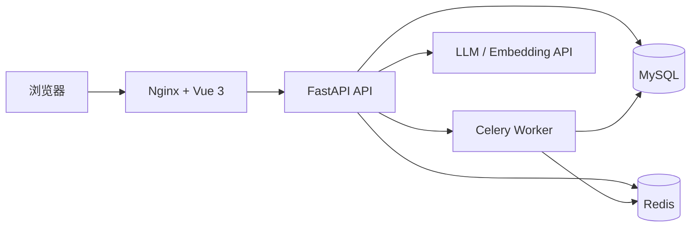

<div align="center">

# 🕸️ UniGraph

**面向知识图谱全生命周期的可视化构建、管理与问答平台**

[](https://vuejs.org/)
[](https://fastapi.tiangolo.com/)
[](https://www.python.org/)
[](https://docs.docker.com/compose/)
[](LICENSE)

[快速开始](#-快速开始) · [功能概览](#-功能概览) · [部署文档](docs/DEPLOYMENT.md) · [公开前清单](docs/OPEN_SOURCE_CHECKLIST.md) · [安全策略](SECURITY.md)

</div>

UniGraph 将知识库、Schema 设计、图谱构建、图谱应用与问答组织在一个 Web 工作台中。前端使用 Vue 3，后端基于 FastAPI，并通过 Celery、MySQL 与 Redis 处理持久化和异步任务。

> 当前仓库适合开发、研究与受控环境部署。正式对公网开放前，请完成密钥轮换、HTTPS、网络访问控制、备份和容量评估。

## ✨ 功能概览

- **知识库管理**：创建、查看和维护知识库及其基础信息。
- **Schema 设计**：管理实体类型、关系类型及图谱结构。
- **图谱构建**：导入文件、执行构建任务并跟踪异步进度。
- **图谱可视化**：浏览实体、关系和图结构。
- **知识问答**：基于已构建知识图谱进行检索与对话。
- **模型配置**：管理 LLM 提供商、模型和嵌入模型参数。
- **账号与权限**：提供注册、登录、JWT 会话与 RBAC 基础能力。
- **对话分享**：生成只读对话快照并通过公开链接访问。

## 🧩 技术架构



| 层级 | 主要技术 | 用途 |
| --- | --- | --- |
| Web | Vue 3、Vite、TypeScript、Cytoscape | 工作台、图谱编辑与可视化 |
| API | FastAPI、Pydantic、SQLAlchemy | 接口、认证、业务与数据访问 |
| 任务 | Celery、Redis | 图谱构建等异步任务 |
| 数据 | MySQL、Redis | 业务数据、会话、缓存与任务状态 |
| 部署 | Docker Compose、Nginx | 一键编排和前端反向代理 |

## 🚀 快速开始

### 1. 环境要求

- Docker 24+
- Docker Compose v2
- 可用的 OpenAI 兼容 Embedding API

### 2. 创建配置

```bash
cp .env.docker.example .env.docker
```

Windows PowerShell：

```powershell
Copy-Item .env.docker.example .env.docker
```

编辑 `.env.docker`，至少替换以下值：

- `MYSQL_PASSWORD`
- `REDIS_PASSWORD`
- `TOKEN_SECRET_KEY`
- `OPERA_LOG_ENCRYPT_SECRET_KEY`
- `OPENAI_API_KEY`
- `CORS_ALLOWED_ORIGINS`（公网部署时填写真实前端 Origin，格式为 JSON 数组）

可以用 Python 生成随机密钥：

```bash
python -c "import secrets; print(secrets.token_urlsafe(48))"
python -c "import secrets; print(secrets.token_hex(32))"
```

`JXNU_AES_SECRET_KEY` 仅在启用 JXNU 单点登录时填写，值必须是 Base64 编码的 AES 密钥。

### 3. 启动服务

```bash
docker compose --env-file .env.docker up -d --build
docker compose --env-file .env.docker ps
```

启动后访问：

- Web：<http://localhost:8080>
- OpenAPI（开发环境）：<http://localhost:8000/knowg/v1/docs>

数据库首次启动时会加载 `dockerunigraph.sql` 创建表结构；系统不预置公开账号，请从登录页注册。

查看日志或停止服务：

```bash
docker compose --env-file .env.docker logs -f
docker compose --env-file .env.docker down
```

传统部署、生产 Compose 叠加配置和 Nginx 示例见 [部署文档](docs/DEPLOYMENT.md)。

## 📁 项目结构

```text
.
├── backend/                 # FastAPI、业务模块、任务与数据库访问
│   ├── app/                 # admin / kgbase / task / file 等业务路由
│   ├── common/              # 公共能力与知识图谱核心层
│   ├── core/                # 配置、应用注册与生命周期
│   └── migrations/          # 增量 SQL 迁移
├── frontend/                # Vue 3 工作台
│   └── src/                 # 页面、控制器、API、图渲染与组件
├── docker/nginx/            # Nginx 模板与运行时配置脚本
├── docs/                    # 部署文档
├── docker-compose.yml       # 基础服务编排
└── dockerunigraph.sql       # 首次启动数据库结构
```

## 🛠️ 本地开发

前端：

```bash
cd frontend
npm ci
npm run dev
```

后端的本地环境配置从 `backend/.env` 读取。先复制模板并安装依赖：

```bash
cp backend/.env.template backend/.env
python -m venv .venv
python -m pip install -r backend/requirements.txt
uvicorn backend.main:app --reload --host 0.0.0.0 --port 8000
```

常用检查：

```bash
ruff format --check backend
ruff check backend
python -m unittest discover -s backend/tests -v
python backend/tests/smoke_import.py
pip-audit --requirement backend/requirements.txt --no-deps --disable-pip
cd frontend
npm run lint
npm run typecheck
npm run build
npm audit --audit-level=high
```

## 🔐 安全提示

- `.env`、私钥、PFX、日志、上传文件和本地数据库均不应提交到 Git。
- 如果密钥曾进入 Git 历史，删除文件并不足够；请立即轮换密钥，再清理历史后发布。
- MySQL、Redis 和后端端口默认只绑定到 `127.0.0.1`；对公网只开放前端，并通过 HTTPS 反向代理访问。
- 安全问题请按 [SECURITY.md](SECURITY.md) 私下报告。

## 🤝 参与贡献

欢迎提交 Issue 和 Pull Request。请先阅读 [CONTRIBUTING.md](CONTRIBUTING.md)，并确保改动聚焦、可验证且不包含任何真实数据或凭据。

## 📄 开源许可

本项目以 [MIT License](LICENSE) 开源。项目包含或改编了其他 MIT 项目的代码，完整归属信息见 [THIRD_PARTY_NOTICES.md](THIRD_PARTY_NOTICES.md)。
