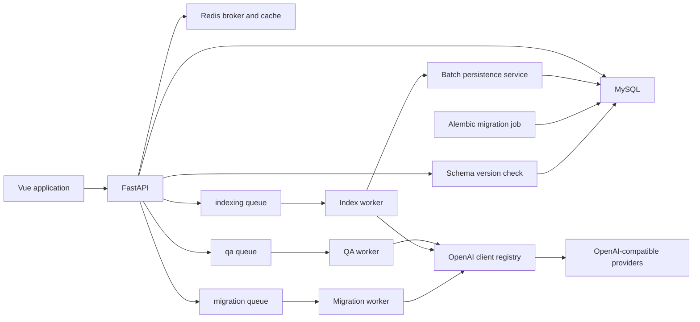
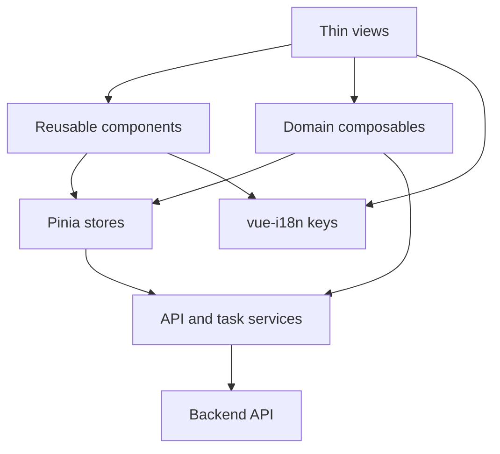

# UniGraph 工程化优化总实施方案

> 文档基线：`47cd790`（2026-08-05）
>
> 目标：在不改变当前索引深度、不改变现有页面视觉、不删除现有功能的前提下，一次性规划并分阶段完成任务隔离、数据库版本治理、前端架构治理、模型调用性能优化和 Docker 发布稳定性改造。

## 1. 文档定位

这不是一份只描述方向的建议书，而是一份可以直接用于实施、评审和验收的工程改造规格。

本文覆盖以下八项工作：

1. 问答、索引、知识迁移使用独立 Celery 队列和 worker。
2. 给数据库增加迁移版本检查。
3. 在干净环境中分别验证传统部署和 Docker 部署。
4. 将用户、聊天、任务状态收敛到统一 store/composable。
5. 拆分上千行前端控制器。
6. 恢复规范的 key-based 国际化。
7. 复用模型 HTTP 连接池，批量生成向量并批量写数据库。
8. 完善 Docker 缓存、跨域和动态 chunk 部署。

“一次性完成”指所有工作纳入同一项工程目标和同一套验收标准，不代表把全部修改塞进一个提交。实施必须分阶段，每个阶段独立通过回归后才能进入下一阶段。

## 2. 不可破坏的基线

本次改造必须遵守以下边界：

- 索引深度继续保持当前行为，不调整 `level=4`。
- 不修改现有页面的整体视觉、布局和交互含义。
- 不删除现有问答、引用、分享、任务中心、图谱模式和模型配置功能。
- 不改变现有 API 路径，除非同时提供兼容层。
- 已进入 Celery 的旧任务必须能够完成或得到明确迁移提示。
- 不把用户 token、API Key、数据库密码写入任务缓存、日志或前端持久化。
- 每个阶段都必须保持后端测试、前端构建和 Compose 校验通过。
- 不进行无关格式化，不借机重写知识抽取算法。

## 3. 当前问题基线

### 3.1 Celery

当前只有一个 Celery 应用和一个默认 worker：

- 配置入口：`backend/app/task/celery.py`
- 配置模型：`backend/app/task/conf.py`
- 默认并发：`CELERY_WORKER_CONCURRENCY=4`
- Docker 服务：`compose.yaml` 中的 `celery`

问答、索引和知识迁移当前没有配置 `task_routes`，会进入同一默认队列：

- `knowledge_graph.ask`
- `knowledge_graph.build_index`
- `knowledge_graph.infer_knowledge_graph`

长时间索引或迁移任务可以占满 worker，导致问答已经提交但迟迟不能开始。

### 3.2 数据库迁移

当前存在四份手工 SQL：

- `20260724_chat_history.sql`
- `20260728_chat_share.sql`
- `20260730_multi_user_constraints.sql`
- `20260803_llm_provider_sort_order.sql`

部署者需要自行判断执行过哪些迁移。项目没有统一的数据库版本记录，也没有在后端启动时验证数据库结构是否与代码匹配。

### 3.3 前端状态和控制器

当前前端已有 `composables/`，但只有 `useAppMotion.ts`。核心状态仍分散在：

- `frontend/src/api/runtime/auth.js`
- `frontend/src/services/sidebar-chat.js`
- `frontend/src/services/task-manager.js`
- `frontend/src/controllers/*.js`
- `localStorage`
- `window.Auth`、`window.ChatSidebar`、`window.TaskManager`
- `window` 自定义事件和直接 DOM 更新

主要控制器规模：

| 文件 | 当前行数 | 主要职责 |
|---|---:|---|
| `GraphApplicationView.js` | 1944 | 聊天、问答任务、历史、引用、消息渲染、输入框 |
| `GraphBuildView.js` | 1352 | 图谱加载、模式、实体关系编辑、索引、导出 |
| `GraphDesignView.js` | 1106 | 架构加载、类型编辑、生成任务、画布交互 |
| `ProfileView.js` | 688 | 用户资料、头像、模型提供商、排序和连接测试 |

### 3.4 国际化

`frontend/src/services/i18n.js` 目前以中文原文作为 key，并混合静态映射、运行时替换和后端日志翻译。新增文本很容易遗漏，重命名中文文案也会破坏翻译匹配。

### 3.5 模型调用和索引写库

`response_getter.py` 的每次聊天、流式聊天和向量请求都会创建并关闭一个 `AsyncOpenAI` 客户端。索引阶段每个实体单独请求向量。

`knowledge_graph.py` 在索引完成后：

- 逐条写入社区报告。
- 逐条写入实体向量。
- 逐条写入实体与社区映射。

这会产生大量网络连接建立和数据库往返。

### 3.6 Docker 与动态资源

当前已经做到：

- `config.js` 不缓存。
- `index.html` 不缓存。
- `/knowg/` 关闭代理缓冲。
- 后端和前端有健康检查。

仍需完善：

- hashed assets 没有明确的长期 immutable 缓存。
- `/unigraph/assets/` 依赖 rewrite，资源缓存规则不集中。
- 新旧容器切换时，旧页面可能请求已经不存在的旧 chunk。
- 动态模块加载失败没有统一的一次性刷新恢复机制。
- CORS 配置错误时缺少启动前诊断。
- Compose 中只有一个 Celery worker，也没有独立迁移服务。

## 4. 目标总体架构



前端目标：



## 5. 工作流一：Celery 队列和 worker 隔离

### 5.1 目标队列

| 队列 | 任务 | 特征 | 建议并发 |
|---|---|---|---:|
| `qa` | `knowledge_graph.ask` | 用户交互、低延迟 | 8 |
| `indexing` | `knowledge_graph.build_index` | 网络和数据库密集 | 2 |
| `migration` | `knowledge_graph.infer_knowledge_graph` | 长时间模型推理 | 2 |
| `default` | 架构构建、图谱构建、清理任务 | 一般后台任务 | 2–4 |

并发值必须可通过环境变量修改，表中数字只作为 Docker 默认值。远程模型限流较低时应降低并发，不能只依赖增加 worker 数量。

### 5.2 后端修改

修改 `backend/app/task/conf.py`：

- 增加队列名称配置。
- 增加各 worker 默认并发配置。
- 增加任务到队列的明确映射。

修改 `backend/app/task/celery.py`：

- 使用 `kombu.Queue` 声明 `default`、`qa`、`indexing`、`migration`。
- 配置 `task_default_queue='default'`。
- 配置 `task_routes`。
- 设置 `worker_prefetch_multiplier=1`，防止一个 worker 提前占有多个长任务。
- 对长任务启用 `task_acks_late` 前必须验证任务幂等性；未完成幂等改造前不要全局开启。

建议路由：

```python
task_routes = {
    'knowledge_graph.ask': {'queue': 'qa'},
    'knowledge_graph.build_index': {'queue': 'indexing'},
    'knowledge_graph.infer_knowledge_graph': {'queue': 'migration'},
}
```

### 5.3 Docker 修改

把 `compose.yaml` 中单一的 `celery` 拆成：

- `celery-default`
- `celery-qa`
- `celery-indexing`
- `celery-migration`

示例命令：

```yaml
command:
  - celery
  - -A
  - backend.app.task.celery:celery_app
  - worker
  - --queues=qa
  - --concurrency=${CELERY_QA_CONCURRENCY:-8}
  - --loglevel=info
```

传统 Linux 部署同步增加四个 systemd unit；Windows 开发环境按队列分别启动 `--pool=solo` worker。

### 5.4 发布迁移

发布前先停止任务提交，等待旧默认队列清空，再部署新路由。不能在默认队列仍有旧任务时直接只启动新队列 worker。

推荐顺序：

1. 后端进入维护模式，禁止提交新长任务。
2. 检查默认队列和 active task。
3. 等待任务完成或由用户明确取消。
4. 部署新代码和四类 worker。
5. 恢复任务提交。

### 5.5 验收标准

- 同时提交问答、索引、知识迁移，三种任务分别进入正确队列。
- 索引和迁移运行时，新问答能够在 2 秒内进入 `STARTED`。
- 停止 `celery-indexing` 只影响索引，不影响问答。
- 任务取消、重试、所有权检查和任务中心状态保持原行为。
- 任务参数和 Redis 状态中不保存明文 token。

## 6. 工作流二：数据库迁移版本检查

### 6.1 方案选择

使用 Alembic 管理后续迁移，保留当前 SQL 作为历史资料，不再继续增加无版本记录的手工 SQL。

建议新增：

```text
alembic.ini
backend/alembic/env.py
backend/alembic/script.py.mako
backend/alembic/versions/
backend/database/schema_version.py
```

不要直接把现有 `backend/migrations/` 改造成 Alembic 目录，以免历史 SQL 路径失效。

### 6.2 当前数据库基线

创建一个 no-op 基线 revision，例如：

```text
20260805_current_schema_baseline
```

它表示数据库已经包含：

- 聊天消息与来源表。
- 对话分享表。
- 用户内唯一约束和密钥字段扩容。
- 模型排序字段。

首次引入 Alembic 时不能盲目 `stamp head`。新增基线检查器，检查关键表、字段和约束是否存在：

- 全部存在：允许 stamp 到基线。
- 部分存在：拒绝启动，输出缺失迁移和修复命令。
- 全部不存在且是空数据库：先执行初始化 schema，再 stamp 基线。

### 6.3 启动行为

生产环境分成两个职责：

- `migrate` 进程执行 `alembic upgrade head`。
- 后端启动时只检查数据库 revision 是否为 head，不自动修改数据库。

这样可以避免多个后端副本同时执行迁移。

开发环境允许显式执行：

```bash
python -m alembic upgrade head
```

### 6.4 Compose 修改

新增一次性 `migrate` 服务：

- 等待 MySQL healthy。
- 执行 Alembic upgrade。
- backend 和 Celery 等待 migrate 成功。
- migrate 失败时其他应用服务不启动。

### 6.5 CI 检查

增加以下测试：

1. 从空数据库初始化后升级到 head。
2. 从当前基线升级到 head。
3. 数据库低于 head 时后端给出明确错误。
4. revision 和 ORM model 不一致时 CI 失败。
5. 同一迁移重复执行不会破坏数据。

### 6.6 验收标准

- `alembic current` 和 `alembic heads` 一致。
- 漏迁移时后端拒绝静默启动，并明确显示当前版本和目标版本。
- Docker 新数据库能够自动完成初始化和版本登记。
- 已有数据库完成一次基线确认后可以正常升级。
- 回滚前必须备份；生产环境不自动执行 destructive downgrade。

## 7. 工作流三：统一用户、聊天和任务状态

### 7.1 技术选择

引入 Pinia，使用 Vue 官方生态的 store 管理跨页面状态。composable 管理业务流程和组件生命周期，service 只负责 API 与持久化。

新增建议结构：

```text
frontend/src/stores/user.ts
frontend/src/stores/chat.ts
frontend/src/stores/task.ts
frontend/src/composables/useCurrentUser.ts
frontend/src/composables/useChatHistory.ts
frontend/src/composables/useQuestionTask.ts
frontend/src/composables/useTaskPolling.ts
frontend/src/services/auth-service.ts
frontend/src/services/chat-service.ts
frontend/src/services/task-service.ts
```

### 7.2 用户状态

`userStore` 是用户资料的唯一内存来源：

- `token`
- `profile`
- `isAuthenticated`
- `isHydrated`
- `locale`
- `theme`

头像、用户名和昵称更新流程：

1. 页面调用 service 更新后端。
2. service 返回最新用户对象。
3. store 原子替换 `profile`。
4. AppSidebar、ProfileView 和菜单自动响应。
5. localStorage 只作为启动缓存，不作为第二业务状态源。

保留 `window.Auth` 作为一轮兼容适配器，但内部转发到 store/service；所有页面迁移完成后删除全局对象。

### 7.3 聊天状态

`chatStore` 统一维护：

- 所有知识库的历史对话摘要。
- 当前知识库和当前对话。
- 收藏、排序和搜索状态。
- 当前可选索引列表。
- 当前消息列表和加载状态。

删除 `sidebar-chat.js` 中直接拼接 HTML 和 inline `onclick` 的实现，改为 Vue 组件渲染。新建对话、删除、重命名、收藏后只更新 store，侧边栏和问答页共享同一份响应式状态。

### 7.4 任务状态

`taskStore` 统一维护：

- 当前用户任务列表。
- 展开状态。
- 日志滚动跟随状态。
- 轮询生命周期。
- 完成通知状态。
- 问答任务与后台任务的显示策略。

`TaskManager` 中网络请求、状态、DOM 渲染和声音通知需要拆开：

- `task-service.ts`：提交、查询、取消、重试。
- `useTaskPolling.ts`：轮询和页面生命周期。
- `taskStore`：任务数据和派生状态。
- `TaskCenter.vue`：纯展示与用户事件。
- `useTaskNotifications.ts`：声音和桌面通知。

### 7.5 持久化规则

- token 使用原有安全存储策略。
- 用户缓存按用户 UUID 分区。
- 任务 localStorage 不保存 `user_token`。
- 登出时清理用户、聊天和任务内存状态。
- 多标签页同步使用 `storage` 或 `BroadcastChannel`，不再依赖大量自定义 window 事件。
- 后端始终是最终事实来源，缓存只能用于首屏占位。

### 7.6 验收标准

- 更新头像后所有页面立即显示同一头像，刷新后不回退。
- 修改用户名后只允许新用户名登录，缓存不恢复旧用户名。
- 从任意页面新建对话，历史记录和索引列表不丢失。
- 切换知识库时聊天、索引和当前会话不会串库。
- 任务运行时切换页面和刷新，恢复同一个任务，不重复渲染。
- 登出后不存在上一个用户的任务、聊天和头像缓存。

## 8. 工作流四：拆分大型前端控制器

### 8.1 拆分原则

- 按业务能力拆分，不按代码行数机械切文件。
- 纯函数与 DOM 无关，便于单元测试。
- composable 不直接拼接大段 HTML。
- 组件不直接调用全局对象。
- view 只负责页面组合和路由参数。
- API 调用只出现在 service/composable，不出现在展示组件。

### 8.2 问答控制器

将 `GraphApplicationView.js` 拆为：

```text
composables/useChatSession.ts
composables/useQuestionSubmission.ts
composables/useQuestionRecovery.ts
composables/useCitationPopover.ts
composables/useMessageActions.ts
components/chat/ChatMessageList.vue
components/chat/ChatMessage.vue
components/chat/ThinkingTimeline.vue
components/chat/ChatComposer.vue
components/chat/CitationTag.vue
components/chat/CitationPopover.vue
```

前台提交和后台恢复必须共享同一个 `questionTaskStore` 状态机，禁止两个监听器分别创建思考面板。

建议状态：

```text
idle -> submitting -> retrieving -> generating -> completed
                                  -> failed
                                  -> cancelled
```

### 8.3 图谱构建控制器

将 `GraphBuildView.js` 拆为：

```text
composables/useGraphSelection.ts
composables/useGraphData.ts
composables/useGraphMode.ts
composables/useEntityEditor.ts
composables/useRelationshipEditor.ts
composables/useGraphIndex.ts
composables/useGraphExport.ts
components/graph/GraphToolbar.vue
components/graph/GraphModeSwitcher.vue
components/graph/EntityEditorDialog.vue
components/graph/RelationshipEditorDialog.vue
components/graph/ElementDetailPanel.vue
```

`frontend/src/graph/renderer.js` 只保留图渲染适配，不负责业务弹窗和 API。

### 8.4 架构设计控制器

将 `GraphDesignView.js` 拆为：

```text
composables/useSchemaSelection.ts
composables/useSchemaGraph.ts
composables/useEntityTypeEditor.ts
composables/useRelationshipTypeEditor.ts
composables/useSchemaGenerationTask.ts
components/schema/SchemaToolbar.vue
components/schema/EntityTypeDialog.vue
components/schema/RelationshipTypeDialog.vue
components/schema/SchemaElementPanel.vue
```

### 8.5 个人中心

将 `ProfileView.js` 拆为：

```text
composables/useProfile.ts
composables/useAvatarUpload.ts
composables/useModelProviders.ts
composables/useModelSorting.ts
components/profile/ProfileForm.vue
components/profile/AvatarPicker.vue
components/profile/ModelProviderList.vue
components/profile/ModelProviderDialog.vue
```

拖动排序使用组件状态和稳定 key，不通过文本选择或手动交换 DOM 节点。

### 8.6 规模目标

- 单个 view 建议不超过 250 行。
- 单个 composable 建议不超过 300 行。
- 单个组件建议只承担一个交互主题。
- 不以行数作为硬性 CI 失败条件，但超过目标必须在评审中解释。
- 核心业务控制器迁移完成后删除旧文件，不保留两套长期并行实现。

### 8.7 验收标准

- 现有页面截图和关键交互保持一致。
- 业务代码中不再通过 `innerHTML` 生成聊天、任务和侧边栏主体。
- 不再使用 inline `onclick="..."`。
- 页面卸载后没有遗留轮询器、事件监听器和定时器。
- 问答、引用、任务和图谱编辑有对应组件或 composable 测试。

## 9. 工作流五：恢复 key-based 国际化

### 9.1 技术方案

引入 `vue-i18n`，使用稳定语义 key：

```text
frontend/src/locales/zh-CN/common.json
frontend/src/locales/zh-CN/auth.json
frontend/src/locales/zh-CN/chat.json
frontend/src/locales/zh-CN/graph.json
frontend/src/locales/zh-CN/task.json
frontend/src/locales/zh-CN/profile.json
frontend/src/locales/en-US/...
frontend/src/i18n/index.ts
```

示例：

```json
{
  "task": {
    "state": {
      "running": "进行中",
      "success": "已完成",
      "failed": "失败"
    }
  }
}
```

代码使用：

```ts
t('task.state.running')
```

不再使用：

```ts
t('进行中')
```

### 9.2 后端动态日志

任务进度新增兼容字段：

```json
{
  "message_code": "task.index.embedding.progress",
  "message_params": {"completed": 20, "total": 100},
  "message": "正在生成实体向量"
}
```

新前端优先使用 `message_code` 和参数翻译；旧前端继续显示 `message`。完成迁移后仍保留 fallback，避免插件或第三方任务没有翻译 key 时显示空白。

后端运行日志使用英文结构化日志，不需要根据用户语言翻译。用户可见任务消息使用 code，不直接把英文日志当作 UI 文案。

### 9.3 迁移顺序

1. 安装并初始化 `vue-i18n`。
2. 迁移公共导航、按钮和状态。
3. 迁移登录和个人中心。
4. 迁移任务中心和后端 message code。
5. 迁移设计、构建和问答页面。
6. 迁移弹窗、错误和空状态。
7. 删除旧正则和中文原文映射。

### 9.4 质量检查

- CI 检查中英文 key 集合一致。
- 检查插值参数一致。
- 对指定 UI 目录扫描新增的裸中文字符串；测试数据和知识内容目录排除。
- 切换语言后不刷新页面即可更新导航、弹窗、任务状态和错误信息。
- 技术文档继续维护独立中文和英文 Markdown，不用运行时逐句翻译。

## 10. 工作流六：模型 HTTP 连接池与批量处理

### 10.1 客户端复用

新增进程内客户端注册表：

```text
backend/common/clients/openai_client_registry.py
```

客户端按以下维度复用：

- 规范化后的 `base_url`
- API Key 的不可逆哈希标识
- timeout 配置
- 代理配置（如果未来支持）

注册表要求：

- 不在 key、日志和异常中保留明文 API Key。
- 限制最大客户端数量，使用 LRU 回收。
- FastAPI lifespan 关闭全部客户端。
- Celery worker shutdown 时关闭当前进程客户端。
- 连接池大小、连接超时、读取超时可配置。
- 不跨进程共享客户端。

`response_getter.py` 改为从注册表获取客户端，不再每次 `async with AsyncOpenAI(...)`。

### 10.2 并发和重试

- 保留全局 `LLM_MAX_CONCURRENCY`。
- 按 provider 增加 semaphore，防止某一个服务商被集中打满。
- 只对网络错误、429 和部分 5xx 重试。
- 认证失败、参数错误不重试。
- 使用指数退避和随机抖动。
- 所有请求记录 duration、provider、model、status，不记录 prompt 和密钥。

### 10.3 批量向量

修改 `attribute_embedding.py`：

1. 先为每个实体生成规范化文本。
2. 按配置的 batch size 分组，默认建议 32。
3. 一次调用 `embeddings.create(input=[...])`。
4. 根据返回 index 恢复原实体顺序。
5. 验证返回数量和向量维度。
6. 某批因长度限制失败时自动二分该批，而不是立即退化为全部单条请求。
7. 单个实体最终失败时让整个索引任务明确失败，保持当前正确性策略。

不同服务商的 batch 限制不同，新增：

```env
EMBEDDING_BATCH_SIZE=32
EMBEDDING_MAX_BATCH_TOKENS=6000
```

### 10.4 社区报告

聊天补全通常没有真正的 batch API。社区报告继续使用有界并发，但复用客户端连接池。不要把多个社区拼进一次 prompt 后再拆分，这会降低结构化输出稳定性。

### 10.5 批量数据库写入

为以下 service 增加 bulk 方法：

- `community_service.add_many`
- `embedding_service.add_many`
- `knowledge_entity_service.add_community_relations`

写入策略：

- 社区报告批量插入后一次取得 ID 映射。
- 向量按 200–500 条分批插入。
- 实体社区映射去重后批量插入。
- 进度按照已落库数量更新，而不是每条提交一次事务。
- 索引状态只有在所有批次成功后改为完成。
- 保存失败时不得留下 `index_status=1` 的半成品。

如果数据库驱动无法稳定返回批量插入 ID，应先生成应用 UUID，再批量写入，避免逐条查询 ID。

### 10.6 性能验收

建立固定测试数据集，至少记录：

- 实体数量。
- 关系数量。
- 社区数量。
- 模型请求数量。
- TCP 连接数量。
- 向量阶段耗时。
- 社区报告阶段耗时。
- 数据库写入耗时。
- 总耗时和失败率。

通过标准：

- 相同索引深度和相同模型配置下，结果数量一致。
- 100 个实体不再产生 100 次独立 embedding HTTP 请求。
- 数据库 insert 往返次数至少下降 80%。
- 没有新增连接泄漏。
- 429 时能够退避，不产生请求风暴。

## 11. 工作流七：Docker、缓存、跨域和动态 chunk

### 11.1 Nginx 缓存规则

统一处理 `/assets/` 和 `/unigraph/assets/`：

- 文件名带 hash 的资源：`Cache-Control: public, max-age=31536000, immutable`。
- `index.html`：`no-store`。
- `config.js`：`no-store`。
- source map 默认不在生产镜像公开，确需保留时单独授权。

避免 rewrite 后落入普通 SPA location。为 assets 使用明确的 `location` 和 `try_files`，不存在时返回真正的 404，不返回 `index.html`。

### 11.2 动态 chunk 恢复

前端路由增加统一错误处理：

- 识别 `Failed to fetch dynamically imported module`、chunk load error。
- 同一构建版本只自动刷新一次。
- 刷新前清除旧的页面缓存标记，不清除用户 token 和业务数据。
- 第二次仍失败时显示明确的版本更新提示，而不是无限刷新。

建议在构建时注入 `APP_BUILD_ID`，localStorage 记录最近一次恢复的 build ID。

### 11.3 发布原子性

生产发布遵循：

1. 完整构建新镜像。
2. 新容器健康检查通过。
3. 反向代理切换流量。
4. 旧容器保留一个短暂宽限期。
5. 确认没有旧 chunk 请求后再移除旧容器。

单机 Compose 无法自动实现完整蓝绿发布时，至少保证新镜像构建失败不会替换当前运行容器，并保留前一个镜像 tag 便于回滚。

### 11.4 CORS

- 同域生产部署优先使用相对 `/knowg`，不需要跨域。
- `CORS_ALLOWED_ORIGINS` 必须是完整 origin，不包含路径。
- 生产环境拒绝 `*` 与 credentials 同时启用。
- 启动时打印规范化后的 origin 数量，不打印 Cookie 或 token。
- 增加 OPTIONS 预检自动化测试。
- README 分别给出 localhost、IP 和 HTTPS 域名示例。

### 11.5 Runtime config

`40-runtime-config.sh` 不能直接把未经转义的环境变量拼进 JavaScript。改用能够正确 JSON 编码的生成脚本，至少处理引号、反斜杠和换行。

运行时配置生成后执行语法检查；失败则容器退出，不启动一个配置损坏的前端。

### 11.6 Compose

最终 Compose 服务：

```text
mysql
redis
migrate
backend
celery-default
celery-qa
celery-indexing
celery-migration
frontend
```

每个 Celery 服务使用相同镜像、不同队列和并发参数。生产覆盖文件为所有长期服务配置 restart policy、资源限制和日志轮转。

### 11.7 验收标准

- 全新 Docker 主机一条命令可启动。
- HTML 和 config 不缓存，hashed assets 长期缓存。
- 版本更新后旧标签页首次操作能够自动恢复或明确提示刷新。
- 验证码、登录、头像、上传、问答和流式响应在域名环境正常。
- 非允许 Origin 的预检请求被拒绝。
- migration 失败时 backend 和 worker 不启动。
- 回滚到前一镜像不丢失 MySQL、Redis、上传文件和运行日志。

## 12. 工作流八：干净环境完整部署验收

### 12.1 验收环境

至少准备一台没有 UniGraph 历史文件的 Linux 主机或虚拟机。为了避免 Docker 验证掩盖传统部署问题，使用两个独立目录或两台临时主机：

- 环境 A：传统部署。
- 环境 B：Docker Compose 部署。

推荐记录：

- 操作系统和内核。
- Python、Node、MySQL、Redis、Docker 版本。
- Git commit。
- 全部执行命令。
- 服务健康检查结果。
- 关键页面截图和任务 UID。

### 12.2 传统部署流程

必须完全按照 README 和 `docs/DEPLOYMENT.md`，不能使用开发机已有虚拟环境、数据库和 node_modules。

验收步骤：

1. 全新 clone。
2. 根据模板创建环境文件。
3. 创建空数据库。
4. 执行数据库初始化和 Alembic upgrade。
5. 创建 Python 虚拟环境并安装锁定依赖。
6. 使用 `npm ci` 安装前端依赖。
7. 启动 backend、四类 Celery worker 和 frontend/Nginx。
8. 验证 systemd 重启和开机启动。
9. 重启主机后再次验证健康状态。

### 12.3 Docker 部署流程

1. 全新 clone。
2. 创建 `.env.docker` 并生成真实随机密钥。
3. 执行开发 Compose 配置校验。
4. 构建镜像并启动。
5. 检查 migrate 成功。
6. 检查全部容器 healthy。
7. 执行生产覆盖配置校验。
8. 使用域名或 hosts 模拟真实 Origin。
9. 更新一次前端镜像，验证动态 chunk 恢复。
10. 回滚一次镜像，验证持久化数据。

### 12.4 功能冒烟

传统和 Docker 两种部署都必须执行：

1. 注册并登录。
2. 上传和切换头像。
3. 配置语言模型和嵌入模型并测试连接。
4. 创建知识库并上传文档。
5. 生成、人工编辑并保存知识架构。
6. 构建知识图谱。
7. 新增和编辑实体、关系。
8. 建立索引。
9. 发起问答，验证思考过程和四类引用。
10. 问答中切换页面并刷新，验证任务恢复。
11. 同时运行问答、索引和知识迁移，验证队列隔离。
12. 分享对话并在无登录浏览器打开。
13. 切换中英文并检查关键页面。
14. 退出登录并确认缓存清理。

### 12.5 验收产物

将结果保存到：

```text
docs/release-validation/<version>/traditional.md
docs/release-validation/<version>/docker.md
docs/release-validation/<version>/screenshots/
```

报告必须区分：通过、失败、环境限制和未执行，不能把 Compose 能解析写成 Docker 已成功部署。

## 13. 自动化测试体系

### 13.1 后端

保留现有 pytest，并新增：

- Celery 路由测试。
- 队列隔离集成测试。
- Alembic 当前版本测试。
- 旧数据库基线检查测试。
- OpenAI 客户端复用与关闭测试。
- embedding batch 顺序和拆批测试。
- bulk insert 事务与失败回滚测试。
- CORS 预检测试。

### 13.2 前端

新增 Vitest 和 Vue Test Utils：

- user/chat/task store 单元测试。
- composable 生命周期测试。
- i18n key 完整性测试。
- chunk error 一次性刷新测试。

新增 Playwright：

- 登录、头像和用户名。
- 新建对话、历史记录和索引选择。
- 问答提交、刷新恢复和引用弹层。
- 任务中心滚动和状态颜色。
- 实体、关系、架构类型编辑。
- 中英文切换。

### 13.3 CI 门禁

最终 CI 顺序：

1. 后端 Ruff。
2. 后端 pytest。
3. Alembic 空库升级。
4. 前端 ESLint、typecheck、Vitest、build。
5. Playwright 核心流程。
6. npm audit、pip-audit。
7. Compose 开发和生产配置解析。
8. Docker 镜像构建和健康冒烟。

## 14. 实施顺序和提交边界

### 阶段 0：建立保护网

- 增加 Playwright 核心冒烟。
- 固化当前页面截图和 API 行为。
- 建立固定索引性能样本。

提交建议：

```text
test(e2e): cover critical user workflows
test(index): add repeatable performance fixture
```

### 阶段 1：后台基础设施

- Celery 队列隔离。
- Alembic 基线、迁移检查和 migrate 服务。
- Compose worker 拆分。

提交建议：

```text
feat(tasks): isolate background workloads by queue
feat(db): add versioned migration checks
build(docker): add migration and dedicated workers
```

### 阶段 2：模型和索引性能

- OpenAI 客户端注册表。
- 批量向量。
- 批量数据库写入。
- 指标和基准测试。

提交建议：

```text
perf(llm): reuse provider clients and connections
perf(index): batch embeddings and persistence
```

### 阶段 3：前端状态

- Pinia。
- user/chat/task store。
- 兼容适配器。
- 侧边栏和任务中心迁移。

提交建议：

```text
refactor(state): centralize user chat and task state
```

### 阶段 4：前端控制器

- 先问答，再构建，再设计，最后个人中心。
- 每迁移一个页面立即跑 E2E。
- 页面完成后删除对应旧控制器，不长期双轨。

提交建议按页面拆分，禁止一个提交同时重写四个页面。

### 阶段 5：国际化

- 接入 vue-i18n。
- 迁移公共 key。
- 迁移后端任务 message code。
- 删除旧翻译器。

### 阶段 6：Docker 发布稳定性

- Nginx assets 缓存。
- runtime config 安全生成。
- chunk 恢复。
- 原子发布和回滚说明。

### 阶段 7：干净环境验收

- 传统部署。
- Docker 部署。
- 功能冒烟。
- 生成验收报告。

## 15. 回滚策略

### Celery

- 保留 default worker 一个发布周期。
- 新队列出现问题时暂停路由，再恢复 default worker。
- 不移动正在执行的任务。

### 数据库

- 每次迁移前生成数据库备份。
- destructive 迁移必须拆成“兼容新增、代码切换、后续清理”三次发布。
- 应用回滚时数据库必须保持前后两个版本都可读。

### 前端

- store 和控制器迁移使用页面级 feature flag，但 flag 只用于短期发布验证。
- 每个页面迁移完成后保留前一个稳定镜像，不在源码中长期保留两套实现。
- chunk 恢复不得无限刷新。

### 模型和索引

- 保留单条 embedding 路径作为受控 fallback。
- batch 失败只能按批次二分，不能静默跳过实体。
- bulk 写入失败时索引状态保持失败，不能标记完成。

## 16. 最终完成定义

只有同时满足以下条件，整项优化才算完成：

- 三类核心任务进入独立队列并通过并发隔离测试。
- 数据库版本可查询、可升级，版本落后时服务明确拒绝启动。
- 用户、聊天、任务状态只有一个响应式事实源。
- 三个千行控制器被业务组件和 composable 替代。
- 用户可见文案使用稳定国际化 key，中英文 key 完整一致。
- 模型客户端连接得到复用，embedding 和数据库写入完成批量化。
- Docker 具备正确缓存、CORS、迁移、独立 worker 和 chunk 恢复策略。
- 全新环境的传统部署和 Docker 部署都按照公开文档真实成功。
- 后端、前端单元测试、Playwright、依赖审计、Compose 和镜像健康检查全部通过。
- 当前界面、索引深度和已有业务功能没有回归。
- 工作区干净，所有改动按阶段形成可审计提交。

## 17. 完成后的工程水平

完成本方案后，UniGraph 前端将从“Vue 页面加大型控制器和全局 DOM 状态”转为标准的 Vue 3 分层结构；后端将具备任务隔离、数据库版本治理、连接复用和批量持久化；部署将具备可重复初始化、升级、缓存和回滚能力。

这时项目可以达到一般中型 Vue/FastAPI 开源项目中比较规范的工程水平。后续优化应主要是业务迭代和针对真实负载的性能调优，而不再是修复基础架构欠账。
