# UniGraph Technical Architecture

UniGraph connects source material, knowledge modeling, graph construction, indexed retrieval, and citable question answering in one workspace. This document describes the current implementation path and maps each architecture diagram to the code that implements it.

> Reading order: first understand how material becomes a graph, then how a question finds evidence in that graph. External-source validation shown in the diagrams is an extension path and does not mean that the default system browses the web.

The code samples come from this repository. They keep the real call order and important error branches while omitting unrelated parameters, logs, and progress details.

## 1. How one request crosses the system

The Vue workspace starts requests in the browser. FastAPI handles authentication, ownership, and API orchestration. Long-running schema, graph, and index jobs run in Celery. MySQL stores business data, while Redis stores short-lived state and task queues. The question-answering API continuously returns stage events and answer deltas as NDJSON.

| Layer | Responsibility | Code entry |
| --- | --- | --- |
| Vue workspace | Knowledge-base management, graph design and build, streaming Q&A | `frontend/src` |
| FastAPI | Authentication, authorization, uploads, business APIs, streaming protocol | `backend/app` |
| GraphRAG core | Schema, extraction, inference, communities, hybrid retrieval | `backend/common/core_layer` |
| Celery | Long-running schema, graph, and index tasks | `backend/app/task` |
| MySQL / Redis | Persistent data, short-lived state, and task queues | `backend/database`, deployment config |

The core boundary is `KgBase`. Material, schemas, graphs, conversations, and tasks belong to a knowledge base and its users. Read and write APIs validate ownership again instead of trusting a UUID supplied by the browser.

## 2. Define the knowledge structure first

Schema defines the entities, attributes, and relations that are allowed to appear. Constraining extraction before it starts reduces synonym drift, relation-direction errors, and inconsistent attribute formats.

### 2.1 Derive a schema iteratively from material

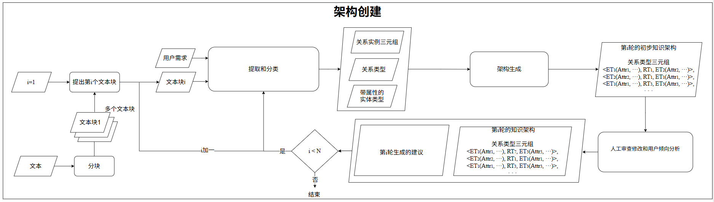

The input is document chunks and the user's goal. Each round extracts entity types, relation types, and attribute constraints, then merges them with the previous result. The output is an editable schema. The implementation lives in `backend/common/core_layer/unigraph/module/schema_construction`.

**Key function:** `SchemaConstruction.extract_kg_schema()`. It extracts instance triples, groups entities and relations, merges types through embedding similarity when a schema already exists, and converts the result into one schema structure.

```python
# backend/common/core_layer/unigraph/module/schema_construction/schema_construction.py
Triple_source_dict, entity_string, relation_string = extract_triples_and_strings(
    extract_triples_from_text_response
)

temp_entity_type_dict = get_new_entity_types_from_response(entity_classify_response)
self.entity_type_dict = await merge_type_dicts_with_semantic(
    self.entity_type_dict,
    temp_entity_type_dict,
    embedding_api_key=embedding_api_key,
    embedding_base_url=embedding_base_url,
    embedding_model=embedding_model,
)

kg_schema = transform_triplets_to_schema(
    Triple_source_dict,
    self.entity_type_dict,
    self.relation_type_dict,
    entity_type_attribute_dict,
)
```

The important design choice is not asking the model to produce the final schema in one shot. Instance extraction, type merging, attribute inference, and structure conversion are separated so every stage can be reviewed and rerun.

### 2.2 Human review is the quality gate

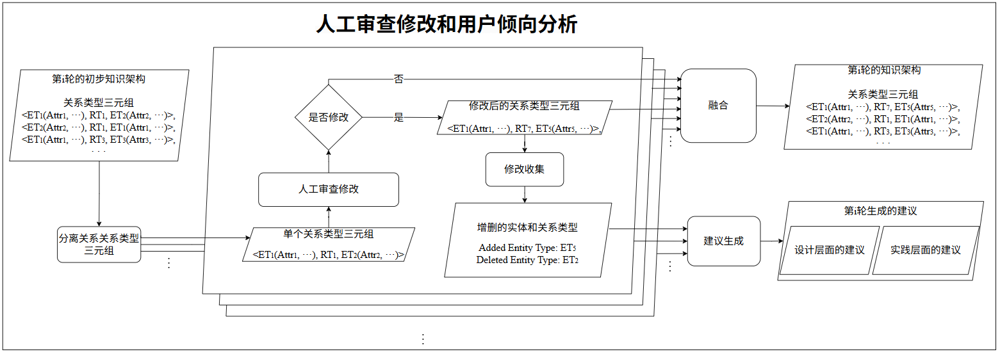

Automatic suggestions do not become final rules immediately. Users can correct entity types, relation direction, and attributes before the reviewed result enters graph construction.

### 2.3 Extraction must return to the schema

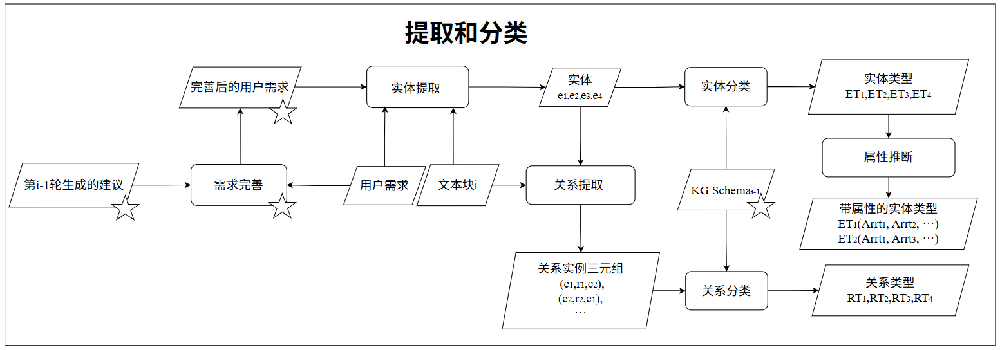

Entities and relations are identified in text and then mapped to existing types. Content that cannot be classified reliably should remain available for review instead of being silently written to the wrong type.

## 3. Turn source material into a knowledge graph

### 3.1 Overall construction flow

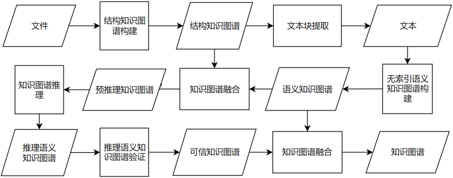

Construction has two paths. Structured data directly produces nodes and edges. Unstructured documents go through conversion, chunking, and semantic extraction. The results are merged and deduplicated, with relation and attribute inference applied when allowed.

### 3.2 Normalize and chunk documents

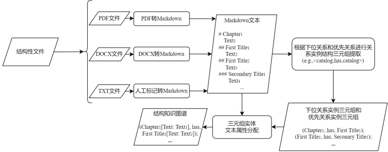

PDF, DOCX, TXT, and other material are converted to a common text representation and split by heading hierarchy and semantic boundaries. Every chunk keeps source metadata so a later answer can cite the original material.

### 3.3 Schema-driven extraction

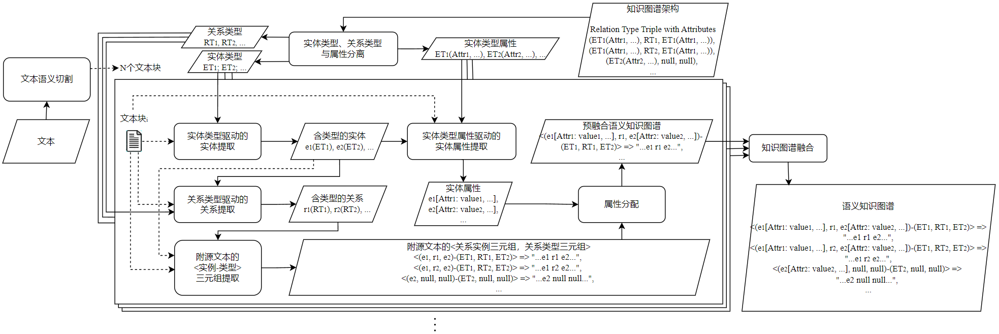

Each text chunk produces entities, entity attributes, and directed relations under schema constraints. Results from multiple chunks are merged by entity identity, type, and relation direction, while source fragments remain attached to each record.

### 3.4 Inference only adds candidates

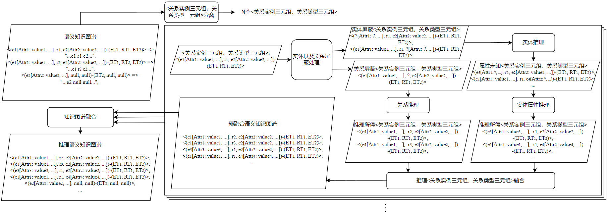

Inference can supplement candidate entities, relations, or attributes, but it does not replace original evidence. Inferred results remain distinguishable from direct extraction for review and traceability. The main orchestration entry is `backend/common/core_layer/interface/kg_services.py`.

### 3.5 Keep validation boundaries explicit

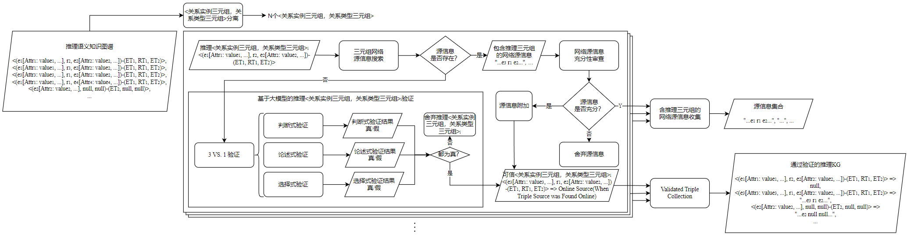

The current implementation focuses on internal structure and consistency across results. External-source validation is an extension path and must handle domain allowlists, timeouts, trust, copyright, SSRF, and audit logs.

## 4. Build searchable indexes

### 4.1 Index overview

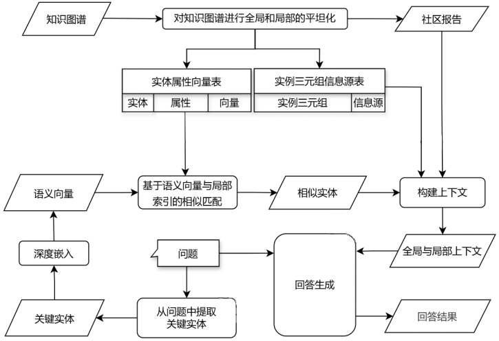

The graph is converted into an analysis graph and partitioned into hierarchical communities with the Leiden algorithm. The system also creates community reports and entity vectors. Q&A combines entity, relation, source-text, and community context instead of relying on vector similarity alone.

### 4.2 Four types of indexed material

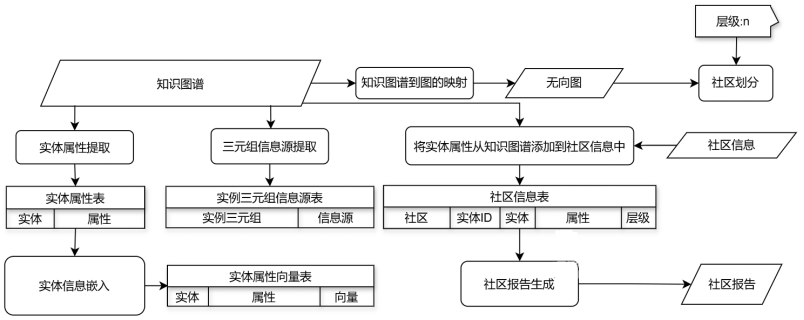

The index keeps four material types: entity-attribute vectors, instance relations, original sources, and community reports. Language and embedding models are configured independently. If vector generation fails, the task must fail clearly instead of leaving an index that appears successful but cannot be queried.

**Key function:** `GraphIndexer.build_index()`. Community detection, report generation, and entity embedding are three consecutive stages using graph algorithms, a language model, and an embedding model.

### 4.3 Community depth controls context

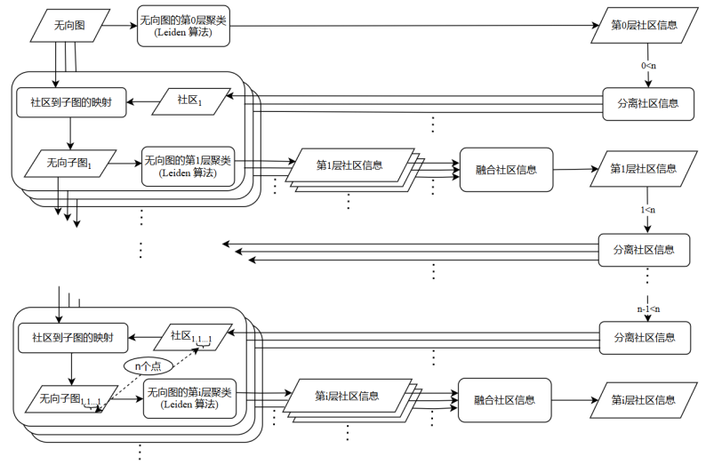

Shallow communities suit precise entity-relation questions. Deeper communities provide broader topic context. Retrieval depth changes the context expansion range, not merely the length of the answer.

### 4.4 Build context around the current question

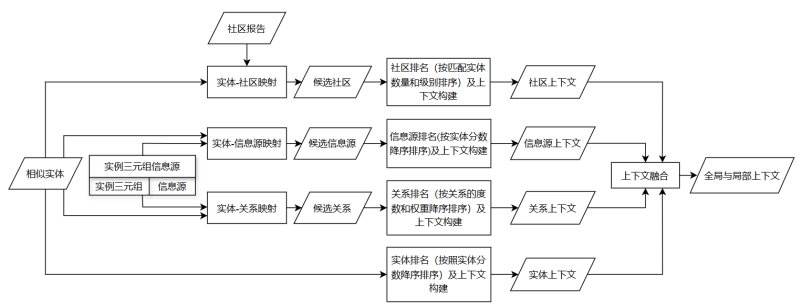

The system extracts key entities from the current question, performs vector matching, and organizes four evidence types around the matches. Conversation history is auxiliary context and cannot replace current graph retrieval.

| Dataset | UI meaning | Role in the answer |
| --- | --- | --- |
| `Entities` | Key knowledge details | Matched entities and attribute details |
| `Relationships` | Related knowledge links | Relation paths between entities |
| `Sources` | Specific sources | Original fragments for fact checking |
| `Reports` | Knowledge overview | Community themes and global background |

`context_data` is not only text sent to the model. It is returned with the result so an inline record ID can resolve to the entity, relation, source, or report actually used in this answer.

## 5. Citable streaming Q&A

The Q&A API returns NDJSON line by line, allowing the frontend to render while data arrives. The visible process is an auditable processing trace, not the model's hidden chain of thought.

| Event | Frontend behavior |
| --- | --- |
| `processing` | Update a collapsible retrieval-stage summary |
| `answer_delta` | Append answer text smoothly |
| `final_result` | Close the answer and bind four citation datasets |
| `error` | Show a sanitized, actionable error |

The backend emits model deltas and processing events through one queue. The final event carries the complete answer and `context_data`. Heartbeats keep long model calls from being mistaken for a broken connection.

The model writes indexes such as `[Data: Entities(...)]` and `[Data: Relationships(...)]`. The frontend parses each index, replaces it with a semantic inline citation, and resolves the referenced record in a hover/focus panel. The answer, index, and retrieved context therefore form one traceable loop.

**Frontend citation parser:** `renderAnswerWithCitations()` accepts only the four dataset names, resolves record IDs from the current `context_data`, and renders the citation panel.

## 6. Tasks, permissions, and deployment

- Schema, graph, and index construction run in Celery; the task center shows stages, errors, and retry status.
- API keys are encrypted with `LLM_API_KEY_ENCRYPTION_KEY`; read APIs never return plaintext.
- Uploaded files are checked for extension, size, final path, and resource ownership.
- Model endpoints have SSRF protection; internal models require an explicit isolated-network allowlist.
- Production traffic should use an HTTPS reverse proxy, with proxy buffering disabled for streaming endpoints.

Long-running tasks are sent through `TaskService.run()` and registered in Redis with their owner. Progress queries and cancellations validate ownership again.

Single-machine deployment starts with `compose.yaml`; production overlays are in `deploy/compose.prod.yaml`. See `SECURITY.md` for security boundaries and `DEPLOYMENT.md` for deployment steps.

## 7. Where to start reading the code

| Goal | Suggested entry |
| --- | --- |
| Application startup and middleware | `backend/main.py`, `backend/core/registrar.py` |
| Schema construction | `backend/common/core_layer/unigraph/module/schema_construction` |
| Graph construction and inference | `backend/common/core_layer/interface/kg_services.py` |
| Leiden communities and entity embeddings | `backend/common/core_layer/unigraph/module/sapperrag/index/graph` |
| Hybrid context retrieval | `backend/common/core_layer/unigraph/module/sapperrag/retriver` |
| Streaming Q&A API | `backend/app/kgbase/api/v1/kgbase/knowledge_graph.py` |
| Frontend Q&A and citations | `frontend/src/controllers/GraphApplicationView.js` |
| Graph rendering | `frontend/src/graph` |
